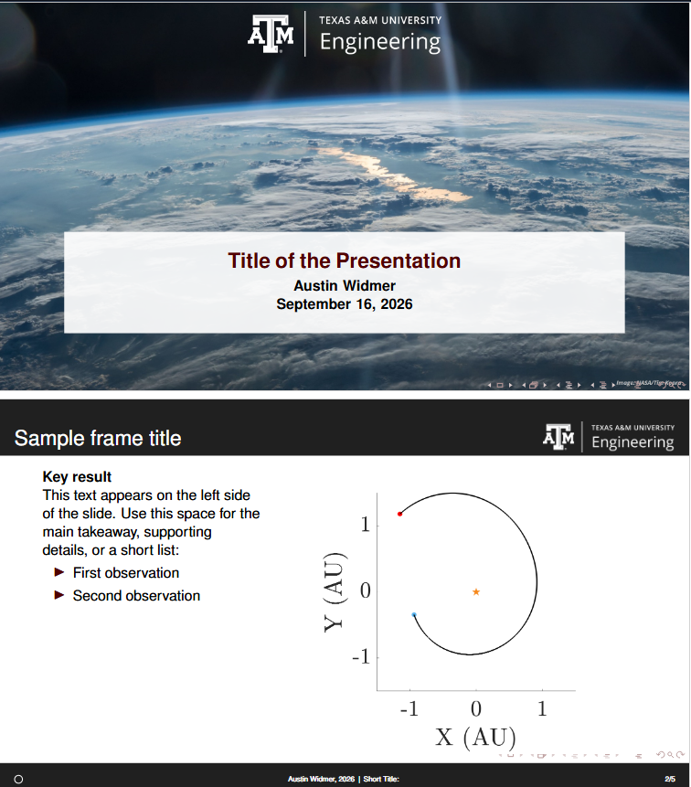

# Texas A&M Engineering Beamer Template

This repository provides a LaTeX beamer template for use by Texas A&M engineering students. It contains style and formatting preferred by the author, as well as some nice celestial body images as the title page and section page backgrounds. 

This template was created by Austin Widmer, a Texas A&M graduate student employee, but all rights and branding associated with Texas A&M remain with the University.

# Contents
This template has a few key features:
1. Slide templates for commonly used frames
2. Page and section counters in the footer
3. A simple name, date, title, section labeling in the footer
4. Inclusion of Texas A&M Engineering Logos and branding  

 

</>